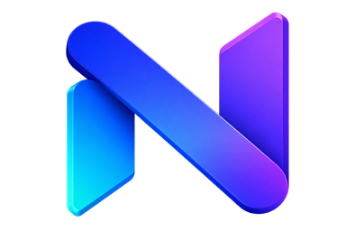
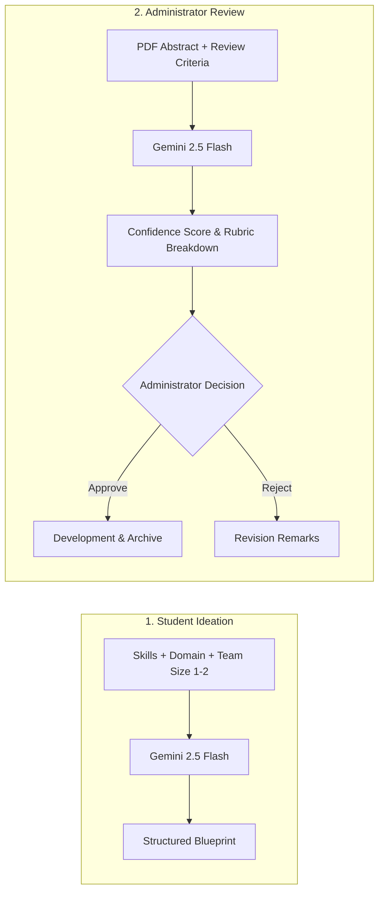
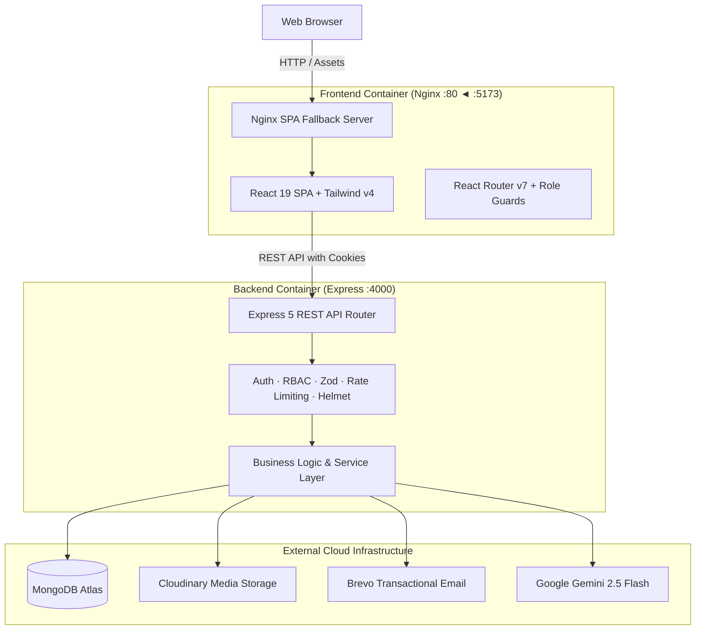

<div align="center">

  

  # Nexora

  ### Academic Capstone Archive & AI-Assisted Proposal Governance

  **Discover past capstones. Submit structured proposals. Review abstracts with AI. Preserve institutional knowledge.**

  <p align="center">
    <a href="#quick-overview">Overview</a> •
    <a href="#why-nexora">Why Nexora</a> •
    <a href="#core-features">Features</a> •
    <a href="#ai-with-humans-in-control">AI Capabilities</a> •
    <a href="#system-architecture">Architecture</a> •
    <a href="#docker-deployment">Docker</a> •
    <a href="#api-overview">API Reference</a>
  </p>

  <p align="center">
    
    
    
    
    
    
    
    
    
  </p>

</div>

---

## Quick Overview

| Discover | Govern | Preserve |
| :--- | :--- | :--- |
| Search historical institutional capstones and generate tailored project blueprints before starting. | Analyze PDF abstracts against college criteria with advisory AI evaluation and administrator decisions. | Build a permanent, searchable institutional archive of verified project assets and code repositories. |

---

## Why Nexora?

### The Problem

Academic project lifecycles are frequently hindered by fragmented communication:
* **Duplicate Submissions**: Students propose topics identical to previous terms without visibility into prior work.
* **Unstructured Review Queues**: Administrators evaluate unstandardized proposal formats via disjointed communication.
* **Scattered Assets**: Codebases, live demonstrations, and technical documentation vanish after evaluation.
* **Lack of Tenant Boundaries**: Institutions lack dedicated environments to enforce their own evaluation standards.

### The Nexora Solution

```text
  Scattered Files & Lost Code           Centralized Institutional SaaS
  Unstructured Proposal Inquiries ──►   Structured Proposal Review Pipeline
  Subjective Evaluation Criteria        Custom Rubrics & Advisory AI Scoring
  Zero Inter-Cohort Visibility          Searchable Archive with Access Control
```

---

## Core Features

| Feature | Category | Description |
| :--- | :--- | :--- |
| **Multi-Tenant Workspaces** | Multi-Tenancy | College-scoped onboarding with unique college codes and email verification. |
| **AI Idea Recommendations** | Intelligence | Generates structured project blueprints tailored to student skills, domain, and team size (1–2). |
| **AI Proposal Evaluation** | Intelligence | Multimodal PDF abstract analysis assessing technical depth, scope, and college rubrics. |
| **Proposal Review Pipeline** | Governance | Full proposal lifecycle tracking: `Submitted` → `Administrator Review` → `Approved / Rejected` → `Resubmission`. |
| **Institutional Project Archive**| Repository | Searchable archive with filtering by search term, research domain, department, and academic year. |
| **Granular Resource Access** | Security | Owner-controlled permissions for private repositories, live demo links, and technical docs. |
| **Institutional KPI Dashboards** | Analytics | Institutional metrics on approval rates, tech adoption, research trends, and student activity. |
| **Activity Notifications** | Workflow | In-app alerts for proposal decisions, access requests, and review feedback. |

---

## AI, With Humans in Control

Nexora integrates **Google Gemini 2.5 Flash** for specialized academic workflows.

> **Governance Principle:**  
> **AI is advisory. Final proposal decisions remain strictly under administrator control.**

<br />



### 1. AI Capstone Recommendations
* **Endpoint**: `POST /api/v1/recommendations`
* **Inputs**: Skillset tags, research domain, difficulty level (`BEGINNER`, `INTERMEDIATE`, `ADVANCED`), team size (1–2), and project type (`ACADEMIC`, `REAL_WORLD`, `INNOVATIVE`, `RESEARCH`).
* **Output Contract**: Returns a validated JSON blueprint containing:
  `title` · `whyRecommended` · `introduction` · `problemStatement` · `proposedSolution` · `keyFeatures` · `technologies` · `expectedOutcome` · `conclusion`.
* **Persistence**: Saved to student history (`GET /api/v1/recommendations`, `DELETE /api/v1/recommendations/:id`).

### 2. AI Multimodal Proposal Review
* **Endpoint**: `POST /api/v1/ai-proposal-review/:id/analyze`
* **Inputs**: Base64-encoded PDF abstract + institutional review criteria (7 standard rules + up to 20 custom college rubrics).
* **Output Contract**: Evaluates PDF content and returns:
  * **Recommendation**: `APPROVE`, `NEEDS_IMPROVEMENT`, or `REJECT`
  * **Confidence Score**: Quantitative index (`0.0` to `1.0`)
  * **Summary & Reasons**: Structured rationale extracted from proposal text
  * **Actionable Suggestions**: Specific technical improvements for the student team
  * **Criteria Breakdown**: Detailed `PASS`, `PARTIAL`, or `FAIL` status with justification for every enabled criterion

---

## Product Workflow

```text
┌──────────────┐     ┌──────────────┐     ┌──────────────┐     ┌──────────────┐     ┌──────────────┐
│  1. DISCOVER │ ──► │  2. PROPOSE  │ ──► │  3. EVALUATE │ ──► │  4. DEVELOP  │ ──► │  5. ARCHIVE  │
└──────────────┘     └──────────────┘     └──────────────┘     └──────────────┘     └──────────────┘
 Explore past         Submit team info     Multimodal AI        Build project        Publish verified
 projects & AI        and upload PDF       analysis + admin     upon proposal        code, demo, docs
 recommendations.    abstract.            decision remarks.    approval.            & manage access.
```

```text
Discover → Ideate → Propose → Review → Approve / Revise → Develop → Publish → Archive
```

1. **Discover & Ideate**: Students explore institutional projects and generate tailored blueprints.
2. **Propose**: Teams submit capstone proposals with attached PDF abstracts.
3. **Review**: Administrators evaluate submissions with advisory AI analysis and issue approval or rejection remarks.
4. **Develop & Publish**: Approved teams develop capstones and publish completed assets with owner-governed permissions.
5. **Archive**: Projects enter the searchable institutional repository for future academic cohorts.

---

## Product Preview

Nexora provides dedicated, role-tailored workspaces built with responsive Tailwind CSS v4 design tokens:

| Workspace | Primary Views | Description |
| :--- | :--- | :--- |
| **Student Workspace** | `StudentDashboardPage.jsx` | Proposal tracker, published project summaries, and access request queues. |
| **Admin Workspace** | `AdminDashboardPage.jsx` | Institutional KPI cards, academic year distributions, and technology adoption charts. |
| **Proposal Governance** | `AdminApprovalsPage.jsx` | Review queue with in-app PDF viewer modal and structured rejection remark forms. |
| **AI Review Workbench** | `AdminAIReviewPage.jsx` | Multimodal evaluation breakdown with confidence scoring and rubric audits. |
| **Project Discovery** | `StudentProjectsPage.jsx` | Multi-facet project search with live screenshot carousels and tag filters. |

*(Interactive UI preview components can be explored directly on the public landing page).*

---

## System Architecture



---

## Roles & Permissions

| Capability | Student | Administrator |
| :--- | :---: | :---: |
| Search & Browse Institutional Project Archive | Yes | Yes |
| Generate AI Capstone Recommendations | Yes | No |
| Submit & Revise Project Proposals | Yes | No |
| Publish & Edit Completed Capstones | Yes | No |
| Request & Grant Resource Access (Code/Demos/Docs) | Yes | No |
| View Institutional KPI Dashboards & Analytics | No | Yes |
| Approve / Reject Student Proposals | No | Yes |
| Trigger Multimodal AI Proposal Reviews | No | Yes |
| Configure College Review Criteria | No | Yes |
| Pin Projects to Featured Showcase | No | Yes |

---

## Security & Data Integrity

| Layer | Implementation Details |
| :--- | :--- |
| **Authentication** | Dual-token JWT architecture (15m access token, 7d refresh token stored hashed in DB). |
| **Session Transport** | HTTP-only cookies with environment-aware `secure` and `sameSite` flags. |
| **Password Security** | `bcrypt` password hashing with 10 salt rounds executed in pre-save hooks. |
| **Payload Validation** | Strict `zod` schemas sanitize all inbound request bodies, params, and AI responses. |
| **Authorization** | `verifyJWT` and `authorizeRoles("student", "admin")` route middleware. |
| **Tenant Isolation** | Database queries scoped to authenticated `college: req.user.college` identifier. |
| **Security Headers** | `helmet` HTTP headers and restricted `cors` origin whitelisting. |
| **Rate Limiting** | Tier-based `express-rate-limit` windows (general, auth, verification, AI limits). |
| **Logging & Redaction** | Structured `pino` logger redacting authorization headers, cookies, passwords, and tokens. |

---

## Tech Stack

```text
Frontend        React 19 · Vite 8 · Tailwind CSS v4 · React Router v7 · Motion · Lucide React
Backend         Node.js (ESM) · Express 5 · Mongoose 9 · JWT · Zod · Multer · bcrypt
AI Engine       Google Gemini 2.5 Flash (@google/generative-ai)
Infrastructure  Docker · Docker Compose · Nginx Alpine · MongoDB Atlas
External APIs   Cloudinary (Media & PDF storage) · Brevo (Transactional emails)
Testing         Jest 30 · Supertest 7 (Mocked Offline Execution)
```

---

## API Overview

Nexora exposes **45 registered HTTP endpoints** (44 REST API routes under `/api/v1` + `GET /`):

| Domain | Base Path | Endpoints | Key Capabilities |
| :--- | :--- | :---: | :--- |
| **Auth & College** | `/api/v1/auth` | 8 | Workspace registration, student signup, JWT session, email verification |
| **Proposals** | `/api/v1/project-proposals` | 7 | Submission, PDF upload, lifecycle status, administrator approvals |
| **Projects** | `/api/v1/projects` | 9 | CRUD operations, multi-facet filtering, resource links, featured showcase |
| **Access Requests** | `/api/v1/projects` | 6 | Peer-to-peer authorization for source code, live demos, and documents |
| **AI Recommendations** | `/api/v1/recommendations` | 3 | Gemini-powered capstone ideation, listing, and deletion |
| **AI Proposal Review** | `/api/v1/ai-proposal-review`| 1 | Multimodal PDF evaluation against institutional criteria |
| **Review Criteria** | `/api/v1/project-review-criteria` | 2 | Standard and custom criteria rubric configuration |
| **Notifications** | `/api/v1/notifications` | 5 | In-app notification feed, unread badge counter, status toggles |
| **Dashboards** | `/api/v1/dashboard` | 2 | Aggregated student summaries and administrator KPI charts |
| **Health & Root** | `/api/v1/healthcheck`, `/` | 2 | Server liveness probe (`GET /api/v1/healthcheck`) and welcome route |

* **Interactive Swagger UI**: Active at `http://localhost:4000/api/docs`
* **OpenAPI 3.0 Contract**: [`backend/src/docs/swagger.yaml`](backend/src/docs/swagger.yaml)
* **Markdown Reference**: [`backend/src/docs/API_REFERENCE.md`](backend/src/docs/API_REFERENCE.md)

---

## Getting Started

### Prerequisites
* **Node.js**: `v20.x` or higher
* **Package Manager**: `pnpm` (v11 recommended)
* **Database**: [MongoDB Atlas](https://www.mongodb.com/atlas) URI (or local MongoDB)
* **API Keys**: Cloudinary, Brevo, and Google AI Studio (Gemini)

---

### Local Development

#### 1. Clone the Repository
```bash
git clone https://github.com/TechSimplifide/nexora.git
cd nexora
```

#### 2. Configure Environment Files

**Backend** (`backend/.env`):
```env
PORT=4000
NODE_ENV=development
MONGO_URI=mongodb+srv://<username>:<password>@cluster.mongodb.net/nexora?retryWrites=true&w=majority
CORS_ORIGIN=http://localhost:5173
CLIENT_URL=http://localhost:5173

ACCESS_TOKEN_SECRET=your_jwt_access_secret_key_here
ACCESS_TOKEN_EXPIRY=15m
REFRESH_TOKEN_SECRET=your_jwt_refresh_secret_key_here
REFRESH_TOKEN_EXPIRY=7d

BREVO_API_KEY=your_brevo_api_key
BREVO_SENDER_NAME=Nexora
BREVO_SENDER_EMAIL=noreply@example.com

CLOUDINARY_CLOUD_NAME=your_cloudinary_cloud_name
CLOUDINARY_API_KEY=your_cloudinary_api_key
CLOUDINARY_API_SECRET=your_cloudinary_api_secret

GEMINI_API_KEY=your_gemini_api_key
LOG_LEVEL=info
```

**Frontend** (`frontend/.env`):
```env
VITE_API_BASE_URL=http://localhost:4000/api/v1
```

#### 3. Run Backend
```bash
cd backend
pnpm install
pnpm run dev
```
* Backend starts at `http://localhost:4000`
* Swagger UI documentation: `http://localhost:4000/api/docs`

#### 4. Run Frontend
```bash
cd ../frontend
pnpm install
pnpm run dev
```
* Frontend starts at `http://localhost:5173`

---

## Docker Deployment

Nexora includes a production-ready multi-container configuration:

* **Backend**: Multi-stage `node:22-bookworm-slim` image running on port `4000`.
* **Frontend**: Multi-stage `node:22-alpine` builder with `nginx:alpine` runtime on port `80` (mapped to `5173`).
* **SPA Routing**: Nginx automatically handles route fallback via `try_files $uri $uri/ /index.html;`.
* **Database**: The application connects to **MongoDB Atlas** via `MONGO_URI`. Docker Compose does not create a local database container.

```bash
# Build and start containers in detached mode
docker compose up --build -d

# Check service status and healthcheck
docker compose ps

# View live container logs
docker compose logs -f

# Stop and remove containers
docker compose down
```

---

## Testing

Nexora includes an automated test suite with **100% passing offline execution**:

```bash
cd backend
pnpm run test
```

```text
Test Suites: 19 passed, 19 total
Tests:       277 passed, 277 total
Snapshots:   0 total
Time:        ~33 s
```

* **9 Integration Suites**: Validate full Express request/response lifecycles, authentication guards, and status codes using `supertest`.
* **10 Unit Suites**: Validate service business logic, data models, and Zod parsing.
* **Mocked Offline Execution**: All external services (Mongoose models, Cloudinary, Brevo, Gemini) are mocked via `jest.unstable_mockModule`.

---

## Repository Structure

```text
Nexora/
├── backend/
│   ├── src/
│   │   ├── config/             # Database (db.js) & Cloudinary setup
│   │   ├── constants/          # Roles, cookie options, review criteria
│   │   ├── controllers/        # Domain request handlers (11 controllers)
│   │   ├── docs/               # Swagger UI loader & OpenAPI 3.0 YAML spec
│   │   ├── middlewares/        # Auth, RBAC, Zod validation, uploads, rate limiting
│   │   ├── models/             # Mongoose schemas (User, College, Project, Proposal, etc.)
│   │   ├── routes/             # Express API route modules (11 files)
│   │   ├── services/           # Business logic, email, AI (Gemini), storage (Cloudinary)
│   │   ├── templates/          # Transactional HTML email templates
│   │   ├── utils/              # ApiError, ApiResponse, Pino logger, upload helpers
│   │   └── validators/         # Zod schemas for input validation
│   ├── tests/                  # 19 Jest & Supertest suites (integration & unit)
│   ├── Dockerfile              # Multi-stage backend production image
│   └── package.json            # Backend dependencies & scripts
│
├── frontend/
│   ├── src/
│   │   ├── app/                # React Router v7 & ThemeProvider setup
│   │   ├── components/         # UI primitives (Button, Input) & common modals
│   │   ├── features/           # Admin, Student, Auth, Landing, and Project modules
│   │   ├── layouts/            # AppLayout, AuthLayout, PublicLayout
│   │   ├── services/           # Native fetch API client layer
│   │   └── index.css           # Tailwind v4 theme design tokens
│   ├── Dockerfile              # Multi-stage frontend Vite build + Nginx runtime
│   ├── nginx.conf              # Nginx SPA fallback configuration
│   └── package.json            # Frontend dependencies & scripts
│
├── docker-compose.yml          # Multi-container orchestration specification
└── README.md                   # Root repository documentation
```

---

## Project Principles

* **AI Assists. Administrators Decide.**  
  AI evaluates proposals against rubrics and generates ideas. Binding institutional governance remains exclusively human-controlled.
* **Projects Outlive Semesters.**  
  Completed capstones transition into searchable institutional archives, preventing repetitive submissions across cohorts.
* **Access Remains Controlled.**  
  Project owners retain granular authority over who can inspect private source code, live demos, and documentation.
* **Strict Tenant Scoping.**  
  Colleges maintain complete data isolation across projects, users, review criteria, and analytical metrics.

---

## Roadmap

* [ ] **Automated Plagiarism & Redundancy Similarity Detection** (Planned)
* [ ] **Multi-Department Academic Sub-Divisions** (Planned)
* [ ] **Batch Student Invitation via CSV Import** (Planned)
* [ ] **Direct Institutional Export & Accreditation Archive Bundles** (Planned)

---

## Contributing

Contributions are welcome. Please adhere to the following workflow:

1. Fork the repository and create a feature branch (`git checkout -b feature/your-feature`).
2. Implement your changes adhering to existing architectural and linting conventions.
3. Verify that all tests pass (`cd backend && pnpm test`).
4. Commit your changes with clear, semantic commit messages.
5. Push to your branch and open a Pull Request.

---

## License

This project is licensed under the **ISC License** as specified in [`backend/package.json`](backend/package.json).

---

<div align="center">

  **Turn completed projects into institutional knowledge.**

  ### Nexora
  *Discover what came before. Build what comes next.*

</div>